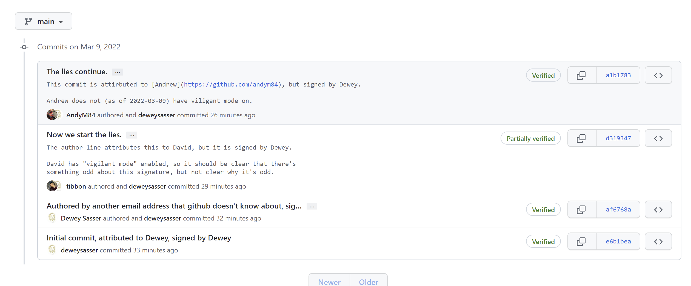
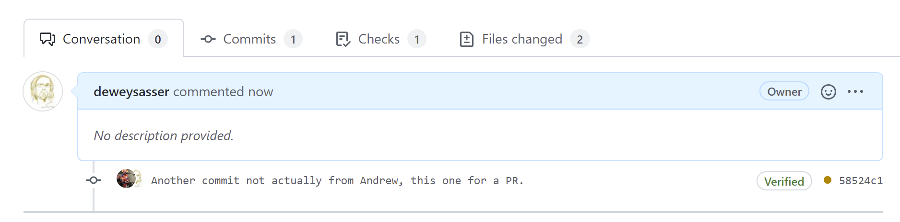

# git-signatures

This repository documents and illustrates the current problem with git GPG signed commits and how those are presented in GitHub.

## The Problem

Signed commits are *NOT* presented in such a way as to make forgeries obvious.

## The Conclusion

Git Signatures are useful for verifying that the commit has not changed since it was signed by a particular key, but are effectively useless at detecting or rejecting forgeries either through GitHub.com or the default CLI.

## The Setup

In this repo, I have made a mixture of commits -- some with the author correctly attributed (to me), some with the author forged but correctly signed.

One of the authors forged has GitHub's "Viligant Mode" enabled, one does not.  It makes a small difference but doesn't really solve the problem.

## The GitHub View

Notice that the person who has "viligant mode" turned on it's clear that there's *something* odd.

You will note from this view, there is at least some information (authored vs committed) to draw your attention, but it is not at all clear that the author attribution is a complete forgery.  So, you'd probably have false confidence in the attribution.



Perhaps the larger problem is the view from PR approvals.  Check this screen shot out, where the only way we can tell that the commit is a forgery is the small sliver of another person's icon behind the allged author.



## The Git CLI view

Here is the view from plain-old-git.

Notice that `git verify-commit` says "Good signature" (which is true), but the signature *does not* match the author of the commit.

Perhaps equally a problem -- the exit value of "verify-commit" indicates success."


```shell
$ git log  -n 1 --show-signature a1b1783e55f78a70594de22ccdc3fd5d5041ca86
commit a1b1783e55f78a70594de22ccdc3fd5d5041ca86 (origin/main)
gpg: Signature made Wed Mar  9 11:55:27 2022 EST
gpg:                using RSA key 3DAAA5BA227FD042BD45DAF67EACFCD1B71E1803
gpg: Good signature from "Dewey Sasser (Release Signing Key) <dewey@deweysasser.net>" [ultimate]
gpg:                 aka "Dewey Sasser (Release Signing Key) <dewey@deweysasser.com>" [ultimate]
gpg:                 aka "Dewey Sasser (Release Signing Key) <dewey@sasser.com>" [ultimate]
Author: Andrew Male <mamale@outlook.com>
Date:   Wed Mar 9 11:54:28 2022 -0500

    The lies continue.

    This commit is attirbuted to [Andrew](https://github.com/andym84), but signed by Dewey.

    Andrew does not (as of 2022-03-09) have viligant mode on.
$ git verify-commit a1b1783e55f78a70594de22ccdc3fd5d5041ca86
gpg: Signature made Wed Mar  9 11:55:27 2022 EST
gpg:                using RSA key 3DAAA5BA227FD042BD45DAF67EACFCD1B71E1803
gpg: Good signature from "Dewey Sasser (Release Signing Key) <dewey@deweysasser.net>" [ultimate]
gpg:                 aka "Dewey Sasser (Release Signing Key) <dewey@deweysasser.com>" [ultimate]
gpg:                 aka "Dewey Sasser (Release Signing Key) <dewey@sasser.com>" [ultimate]
$ echo $?
0
```

## TODO

Things to add to this document:
* How a Github driven branch rebase modifies signatures
* How a CLI given rebase deals with signatures from other people.
* How GitHub actions created commits look